# AC215_HiSolver

## Project Organization

      ├── LICENSE
      ├── README.md
      ├── notebooks
      ├── references
      ├── requirements.txt
      └── src
            ├── collection
            │     ├── README.md
            │     ├── Dockerfile
            │     ├── docker-entrypoint.sh
            │     ├── docker-shell.sh
            │     ├── docker-hub.sh
            │     ├── Pipfile
            │     ├── Pipfile.lock
            │     └── collect.py
            |── preprocessing
            │     ├── README.md
            │     ├── Dockerfile
            │     ├── docker-entrypoint.sh
            │     ├── docker-shell.sh
            │     ├── docker-hub.sh
            │     ├── Pipfile
            │     ├── Pipfile.lock
            │     └── preprocess.py
            |── data-versioning
            |     ├── README.md
            |     ├── docker-shell.bat
            |     ├── docker-shell.sh
            |     ├── Dockerfile
            |     ├── Pipfile
            |     ├── Pipfile.lock
            |     ├── processed_dataset.dvc
            |     ├── processed_dataset
            |     └── cli.py
            |── data-labeling
            |     ├── README.md
            |     ├── Dockerfile
            |     ├── docker-compose.yml
            │     ├── docker-entrypoint.sh
            │     ├── docker-shell.sh
            |     ├── Pipfile
            |     ├── Pipfile.lock
            |     └── cli.py
            |── training
            |     ├── README.md
            |     ├── Dockerfile
            |     ├── run.sh
            |     ├── serverless.sh
            |     └── train.py
            └── deployment
            │     ├── README.md
            │     ├── Dockerfile
            │     ├── docker-entrypoint.sh
            │     ├── docker-shell.sh
            │     ├── docker-hub.sh
            │     ├── Pipfile
            │     ├── Pipfile.lock
            │     ├── custom_handler.py
            │     └── deploy.py
            └── api-service
            │     ├── README.md
            │     ├── Dockerfile
            │     ├── docker-entrypoint.sh
            │     ├── docker-shell.sh
            │     ├── Pipfile
            │     ├── Pipfile.lock
            │     └── api/
            └── frontend
            │     ├── README.md
            │     ├── Dockerfile
            │     ├── docker-shell.sh
            │     └── index.html
            └── deploy-app
            │     ├── README.md
            │     ├── Dockerfile
            │     ├── docker-entrypoint.sh
            │     ├── docker-shell.sh
            │     ├── deploy-docker-images.yml
            │     ├── deploy-create-instance.yml
            │     ├── deploy-provision-instance.yml
            │     ├── deploy-setup-containers.yml
            │     ├── deploy-setup-webserver.yml
            │     └── inventory.yml

---

## Project Intro

**Team Members:**
Yan Kaled, Tom Zhang, Tadhg Looram, Mina Lee, Jason Xiang, Nishtha Sardana & Kareema Batool

**Group Name:**
HiSolver

**Project:**
In this project, we are fine-tuning an LLM for an animation engine (specifically Python package Manim). The goal is to develop an AI application powered by an LLM that can receive user input in the form of raw text consisting of mathematical problems at the SAT level. The application should provide step-by-step solutions or hints for the student - as well as generate Python code for the animation engine. One major challenge would be to construct and fine-tune the said LLM.

## Data Pipeline


Our proposed data pipeline has a few major components: data collection, data pre-processing, data versioning, data labeling, LLM fine-tuning, and modeling deployment. The following is a description of what each component does.

### 1. Data Collection

See `src/collection/README.md` for an in-depth description of how to set up this component of the pipeline.

At this stage, we are using a container to run a python script that scrapes data from GitHub API. The scraper looks for all GitHub repositories containing the keyword "manim" (the animation engine Python package). For each repository, we collect all the Python files, then store them in a Google Cloud Storage (GCS) Bucket.

As of 09/26/2023, there are approximately 2,400 such repositories of interest. It takes approximately 1 second to collect and upload 3 Python files to the GCS bucket.

All files will be stored within the `raw/` folder on the bucket, while preserving directory structure from the original repositories from which they were extracted.

### 2. Data Pre-processing

See `src/preprocessing/README.md` for an in-depth description of how to set up this component of the pipeline.

Now we are parsing each python file we just collected to extract all class definition code snippets (as that's essentially how Manim animations are defined). We separate code snippets into their own JSON files, each with the following structure:

```json
{
  "data": {
    "code": "class DrawCircle(Scene):\n    def construct(): pass"
  }
}
```

Note that at this step we're only worried about extracting the code snippets. Fine-tuning an LLM would also require the input prompt associated with those code outputs. For quality assurance, we will be using Label Studio for humans to manually provide those code summaries. We will describe how to set up Label Studio in the next section.

### 3. Data Versioning

See `src/data-versioning/README.md` for an in-depth description of how to set up this component of the pipeline.

This Python-scripted Docker container is orchestrated to securely download and manage processed data from a designated Google Cloud Storage bucket, aimed at implementing Data Version Control (DVC) on the cloud. Initiated by a shell script, the container interfaces with the Google Cloud environment, pulling relevant data blobs and ensuring their organized local placement, thus facilitating streamlined, secure, and orderly data retrieval and versioning workflows within cloud-based storage solutions.

All files will be stored within the `dvc_store/` folder on the bucket, while preserving directory structure from the original repositories from which they were extracted.

### 4. Data Labeling

See `src/data-labeling/README.md` for an in-depth description of how to set up this component of the pipeline.

This component of the pipeline involves setting up a Label Studio web app so that users can manually provide summaries to those code snippets we previously processed. For the end user, they would access the web app, review a code snippet, then provide a summary of what it does. Then both the user annotation as well as the original code snippet would be uploaded to the `labeled` folder on the GCS bucket.

The figure below illustrates what the Label Studio UI looks like. In particular, the UI allows the user to review code snippets then provide their own annotations.

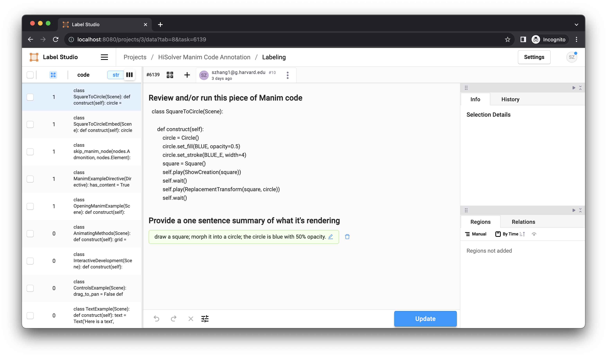

#### 5. LLM Fine-tuning

See `src/training/README.md` for an in-depth description of how to set up this component of the pipeline.

At this stage, we will be taking our labeled data (which are now pairs of prompts and code snippets) and use it to fine-tune a pre-trained LLM available on HuggingFace. Note that before inputting our data to a model, we would first set up a PyTorch custom data class to facilitate efficient data ingestion. This custom data class would also be used to slightly modify the structure of our labeled data so that it would satisfy the format of a pre-trained LLM. We arbitrarily chose a relatively small pre-trained model `DistilGPT2` to facilitate rapid testing. The process is further optimized by employing 16-bit QLoRA for efficient fine-tuning. Eventually, we will be replacing the base model with a more robust one, which would consume more computing resources.

The model is trained serverlessly on Vertex AI. After the job completes, the fine-tuned model is saved to our GCS bucket within the `fine_tuned_model/` directory.

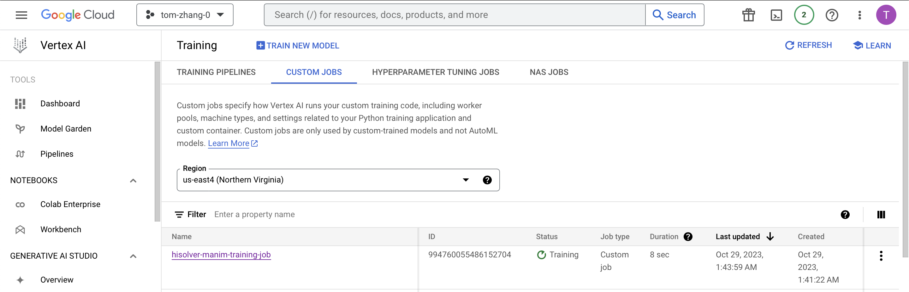

#### 6. Model Deployment

See `src/deployment/README.md` for an in-depth description of how to set up this component of the pipeline.

Now that we have a fine-tuned LLM, we would like to deploy it so Vetex AI. Several steps are involved in this process. First, we download the fine-tuned model produced from our serverless training. Then we package the model artifacts in a model archive file with `torch-model-archiver`. A custom handler file was required to facilitate this command. We then save the model archive to our GSC bucket. And finally, we deploy the model to Vertex AI.

The figure below displays the deployed model endpoint on Vertex AI.

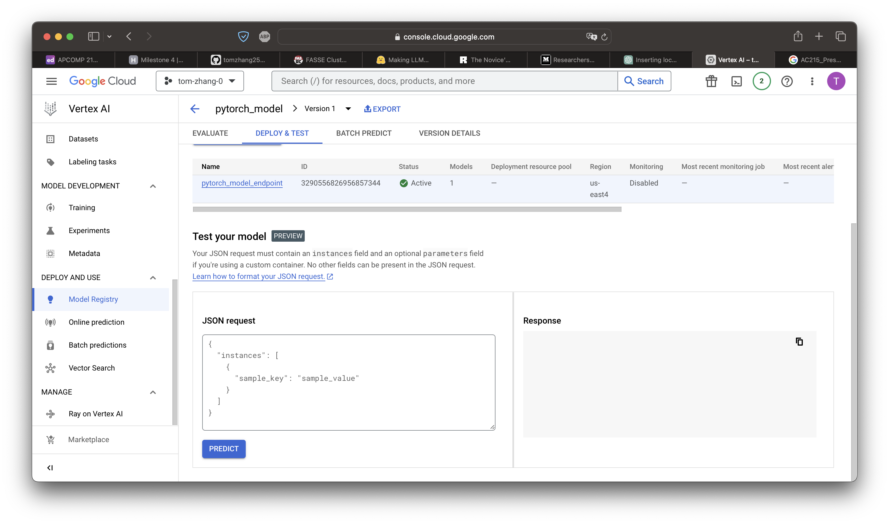

#### 7. Workflow Automation

See `src/workflow/README.md` for an in-depth description of how to set up this component of the pipeline.

At this final step, we automate the entire data pipeline with Vertex AI Pipelines. However, note that at the data-labeling step, Label Studio requires human intervention. Hence, we are breaking the pipeline into two parts. The first part of the pipeline is for data collection, data pre-processing. Then we manually set up Label Studio and populate the GCS bucket with annotated data. After that, we can run the second part of the pipeline, which involves LLM fine-tuning and model deployment.

The figures below exhibit the execution of the two pipelines on Vertex AI.

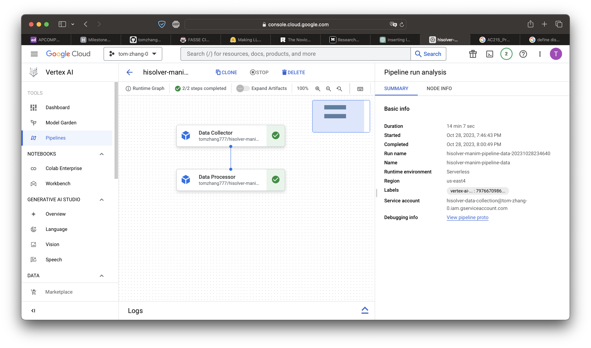

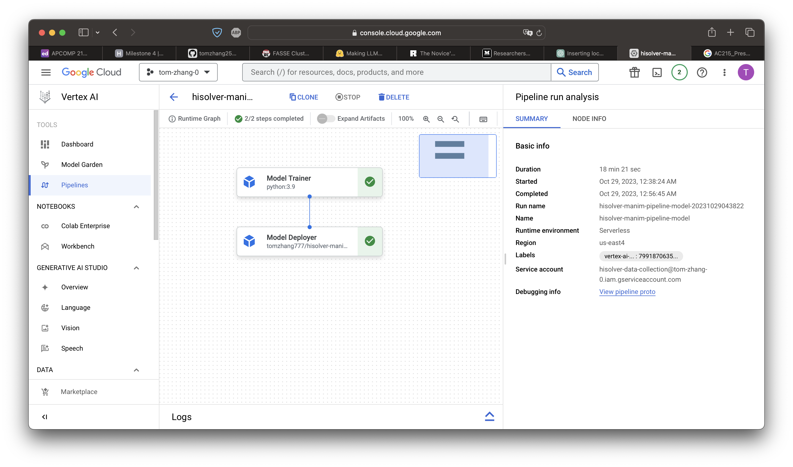

## Design Decisions

This is our solution architecture diagram:


In particular, these are the processed that will be performed by stakeholders: Developers develop app; data scientists fine-tune LLM; end users use app by inputting prompts and receiving a high quality animation rendered by Manim code.

To execute these processes, the following components will be used: a data pipeline to automate relevant ML workflows; a web app frontend that provides a user-friendly interface for the end user; an API backend that interprets interactions from the frontend then communicates with the finalized model deployed by the ML workflow.

Furthermore, these are the elements of the state during the lifecycle of the app: Source control to store/version code; container registry for docker images; image store for data; models and model artifacts store.

This is our technical architecture diagram:

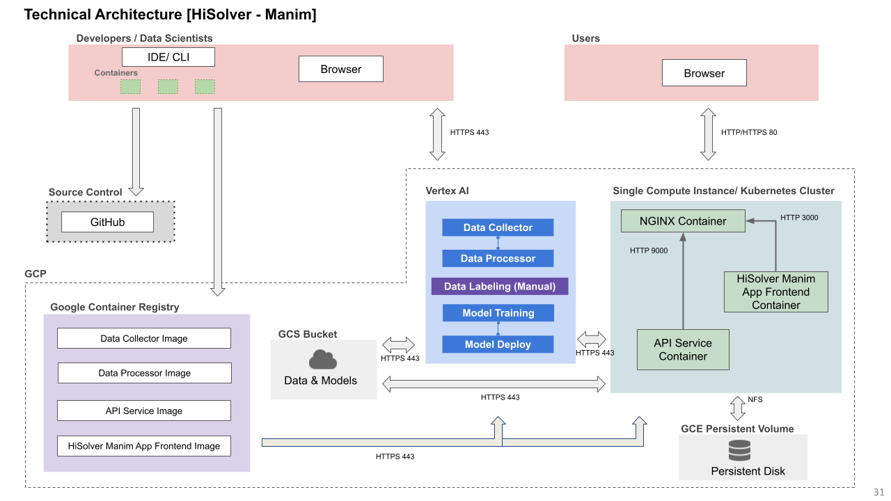

In particular, we use a GCS bucket to store all data (raw and processed) as well as model artifacts. Vertex AI is used to automate the ML workflow, which involved data collection by scraping GitHub, data pre-processing by parsing Python files; and along the way, we pause the pipeline to manually label data using Label Studio. After that, we continue the pipeline by fine-tuning a pre-trained LLM, then deploy the model to Vertex AI. Both the backend and frontend are hosted on a Google Kubernetes Engine (GKE) cluster.

This is our backend API's Swagger Documentation:

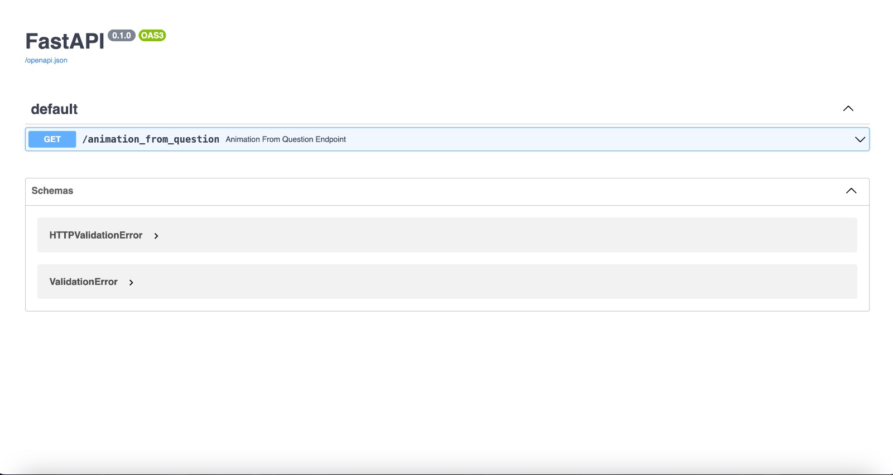

The backend is a FastAPI app properly dockerized with one endpoint that receives user input (prompt), then sends it to the model endpoint on Vertex AI. The Vertex AI model endpoint then returns a code snippet, which is then rendered by Manim. And because it is good practice to have redundancies, we also have a backup option in case the Vertex AI model endpoint is down. In that case, we would make an API call to ChatGPT-4. This way, we can ensure that the end user always receives a response. The job of the backend is to get a response which is Manim package Python code; then the FastAPI renders it into an animation.

The frontend is a simple dashboard built with React with a text input field for prompts. After the user submits it, the animation rendered by the backend is displayed on the page.

## App Deployment

The app is hosted on a Google Kubernetes Engine (GKE) cluster:

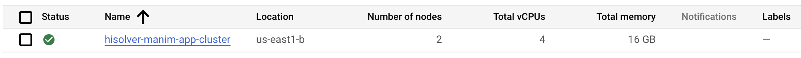

And the entire deployment process was automated with Ansible.

The api-service and frontend folders contain instructions on how to run the code.

## Kubernetes Cluster Configuration Report

Our Kubernetes cluster, deployed on Google Kubernetes Engine (GKE), is meticulously configured to support a React application comprising both frontend and backend components. The cluster, named "hisolver-manim-app-cluster," is initialized with two nodes of the type "n2d-standard-2," each equipped with 30 GB of disk space. This setup offers a balanced combination of computational power and storage, essential for our application's performance requirements.

The cluster's node pool features autoscaling capabilities, ensuring efficient resource utilization by dynamically adjusting the number of nodes based on demand, with a range set from one to the initial node count. Each node is configured with a series of OAuth scopes, enabling appropriate access to other Google Cloud services. To enhance reliability and minimize downtime, both auto-repair and auto-upgrade functionalities are enabled, ensuring that the nodes are always up-to-date and functioning correctly.

In terms of Kubernetes-specific configurations, we have established a dedicated namespace, "hisolver-manim-app-cluster-namespace," to isolate our application deployments within the cluster. This approach aids in resource management and access control. Additionally, the setup includes a Persistent Volume Claim (PVC) with 5Gi of storage in a ReadWriteOnce mode, catering to persistent storage needs.

The ingress setup is handled by the nginx-ingress controller, deployed using Helm, which provides efficient traffic routing and load balancing for our services. It's configured with SSL-redirect disabled and custom rewrite rules, ensuring seamless access to our frontend and API services. The services themselves are exposed via NodePort, with the frontend running on port 80 and the API service on port 8001.

Security and configuration management are addressed through Kubernetes secrets. We securely import GCP service account credentials as a Kubernetes secret, which is then utilized by the API service deployment. This setup not only centralizes credential management but also enhances the overall security posture of our application infrastructure.

This Kubernetes configuration represents a robust, scalable, and efficient environment for hosting our React application, ensuring high availability, security, and optimal performance.

## Demo

The following is a demo of how to use our app.

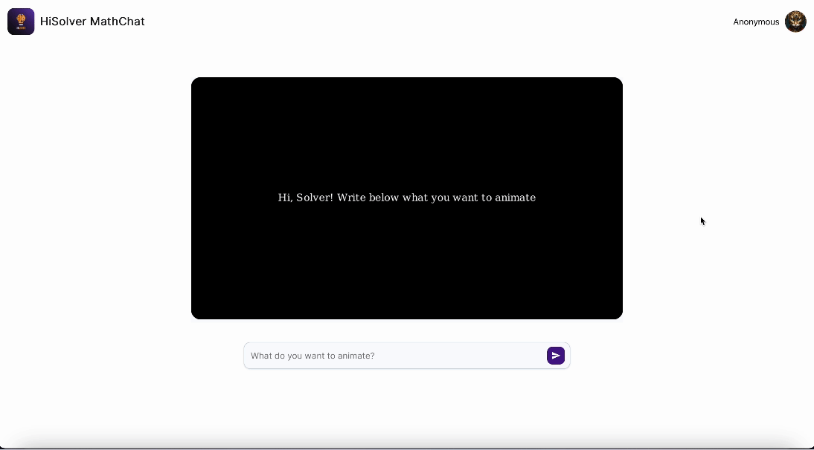

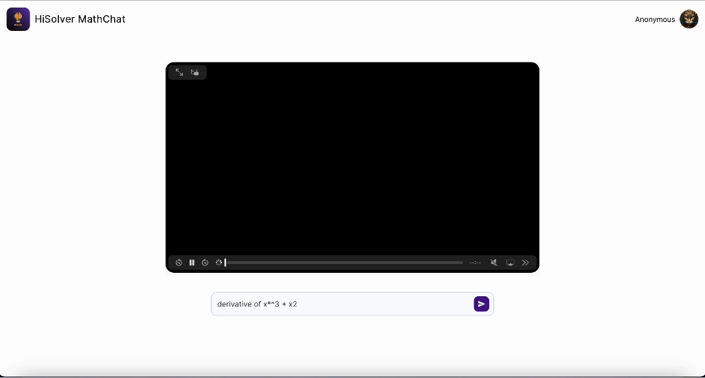

Note that what we've submitted here is only a simple prototype app. The final app with all the functionalities is deployed on [hisolver.com](hisolver.com) with our latest model integrated. Feel free to check it out!

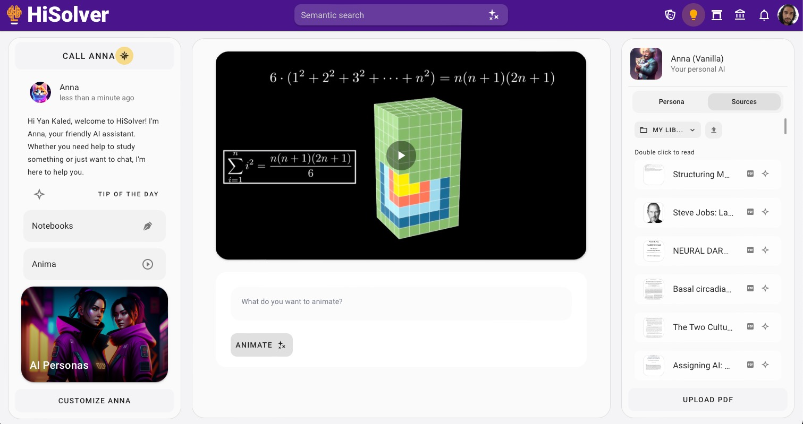
