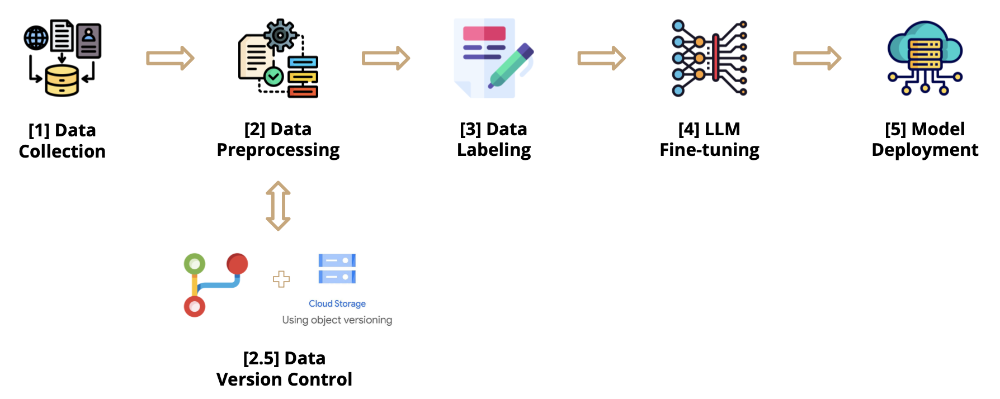
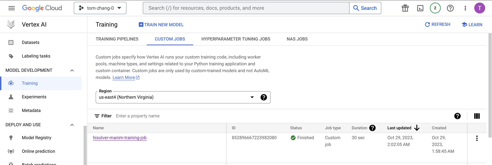

# AC215_HiSolver

## Project Organization

      ├── LICENSE
      ├── README.md
      ├── notebooks
      ├── references
      ├── requirements.txt
      └── src
            ├── collection
            │     ├── README.md
            │     ├── Dockerfile
            │     ├── docker-entrypoint.sh
            │     ├── docker-shell.sh
            │     ├── docker-hub.sh
            │     ├── Pipfile
            │     ├── Pipfile.lock
            │     └── collect.py
            |── preprocessing
            │     ├── README.md
            │     ├── Dockerfile
            │     ├── docker-entrypoint.sh
            │     ├── docker-shell.sh
            │     ├── docker-hub.sh
            │     ├── Pipfile
            │     ├── Pipfile.lock
            │     └── preprocess.py
            |── data-versioning
            |     ├── README.md
            |     ├── docker-shell.bat
            |     ├── docker-shell.sh
            |     ├── Dockerfile
            |     ├── Pipfile
            |     ├── Pipfile.lock
            |     ├── processed_dataset.dvc
            |     ├── processed_dataset
            |     └── cli.py
            |── data-labeling
            |     ├── README.md
            |     ├── Dockerfile
            |     ├── docker-compose.yml
            │     ├── docker-entrypoint.sh
            │     ├── docker-shell.sh
            |     ├── Pipfile
            |     ├── Pipfile.lock
            |     └── cli.py
            |── training
            |     ├── README.md
            |     ├── Dockerfile
            |     ├── run.sh
            |     └── train.py
            └── deployment
            │     ├── README.md
            │     ├── Dockerfile
            │     ├── docker-entrypoint.sh
            │     ├── docker-shell.sh
            │     ├── docker-hub.sh
            │     ├── Pipfile
            │     ├── Pipfile.lock
            │     ├── custom_handler.py
            │     └── deploy.py

---

## Project Intro

**Team Members:**
Yan Kaled, Tom Zhang, Tadhg Looram, Mina Lee, Jason Xiang, Nishtha Sardana & Kareema Batool

**Group Name:**
HiSolver

**Project:**
In this project, we are fine-tuning an LLM for an animation engine (specifically Python package Manim). The goal is to develop an AI application powered by an LLM that can receive user input in the form of raw text consisting of mathematical problems at the SAT level. The application should provide step-by-step solutions or hints for the student - as well as generate Python code for the animation engine. One major challenge would be to construct and fine-tune the said LLM.

## Data Pipeline



Our proposed data pipeline has a few major components: data collection, data pre-processing, data versioning, data labeling, LLM fine-tuning, and modeling deployment. The following is a description of what each component does.

### 1. Data Collection

See `src/collection/README.md` for an in-depth description of how to set up this component of the pipeline.

At this stage, we are using a container to run a python script that scrapes data from GitHub API. The scraper looks for all GitHub repositories containing the keyword "manim" (the animation engine Python package). For each repository, we collect all the Python files, then store them in a Google Cloud Storage (GCS) Bucket.

As of 09/26/2023, there are approximately 2,400 such repositories of interest. It takes approximately 1 second to collect and upload 3 Python files to the GCS bucket.

All files will be stored within the `raw/` folder on the bucket, while preserving directory structure from the original repositories from which they were extracted.

### 2. Data Pre-processing

See `src/preprocessing/README.md` for an in-depth description of how to set up this component of the pipeline.

Now we are parsing each python file we just collected to extract all class definition code snippets (as that's essentially how Manim animations are defined). We separate code snippets into their own JSON files, each with the following structure:

```json
{
  "data": {
    "code": "class DrawCircle(Scene):\n    def construct(): pass"
  }
}
```

Note that at this step we're only worried about extracting the code snippets. Fine-tuning an LLM would also require the input prompt associated with those code outputs. For quality assurance, we will be using Label Studio for humans to manually provide those code summaries. We will describe how to set up Label Studio in the next section.

### 3. Data Versioning

See `src/data-versioning/README.md` for an in-depth description of how to set up this component of the pipeline.

This Python-scripted Docker container is orchestrated to securely download and manage processed data from a designated Google Cloud Storage bucket, aimed at implementing Data Version Control (DVC) on the cloud. Initiated by a shell script, the container interfaces with the Google Cloud environment, pulling relevant data blobs and ensuring their organized local placement, thus facilitating streamlined, secure, and orderly data retrieval and versioning workflows within cloud-based storage solutions.

All files will be stored within the `dvc_store/` folder on the bucket, while preserving directory structure from the original repositories from which they were extracted.

### 4. Data Labeling

See `src/data-labeling/README.md` for an in-depth description of how to set up this component of the pipeline.

This component of the pipeline involves setting up a Label Studio web app so that users can manually provide summaries to those code snippets we previously processed. For the end user, they would access the web app, review a code snippet, then provide a summary of what it does. Then both the user annotation as well as the original code snippet would be uploaded to the `labeled` folder on the GCS bucket.

The figure below illustrates what the Label Studio UI looks like. In particular, the UI allows the user to review code snippets then provide their own annotations.


#### 5. LLM Fine-tuning

See `src/training/README.md` for an in-depth description of how to set up this component of the pipeline.

At this stage, we will be taking our labeled data (which are now pairs of prompts and code snippets) and use it to fine-tune a pre-trained LLM available on HuggingFace. Note that before inputting our data to a model, we would first set up a PyTorch custom data class to facilitate efficient data ingestion. This custom data class would also be used to slightly modify the structure of our labeled data so that it would satisfy the format of a pre-trained LLM. We arbitrarily chose a relatively small pre-trained model `DistilGPT2` to facilitate rapid testing. We were also able to optimize the fine-tuning process further by quantizing it. Eventually, we will be replacing the base model with a more robust one, which would consume more computing resources.



#### 6. Model Deployment

See `src/deployment/README.md` for an in-depth description of how to set up this component of the pipeline.

Now that we have a fine-tuned LLM, we would like to deploy it so Vetex AI. Several steps are involved in this process. First, we download the fine-tuned model produced from our serverless training. Then we package the model artifacts in a model archive file with `torch-model-archiver`. A custom handler file was required to facilitate this command. We then save the model archive to our GSC bucket. And finally, we deploy the model to Vertex AI.

The figure below displays the deployed model endpoint on Vertex AI.


#### 7. Workflow Automation

See `src/workflow/README.md` for an in-depth description of how to set up this component of the pipeline.

At this final step, we automate the entire data pipeline with Vertex AI Pipelines. However, note that at the data-labeling step, Label Studio requires human intervention. Hence, we are breaking the pipeline into two parts. The first part of the pipeline is for data collection, data pre-processing. Then we manually set up Label Studio and populate the GCS bucket with annotated data. After that, we can run the second part of the pipeline, which involves LLM fine-tuning and model deployment.

The figures below exhibit the execution of the two pipelines on Vertex AI.


